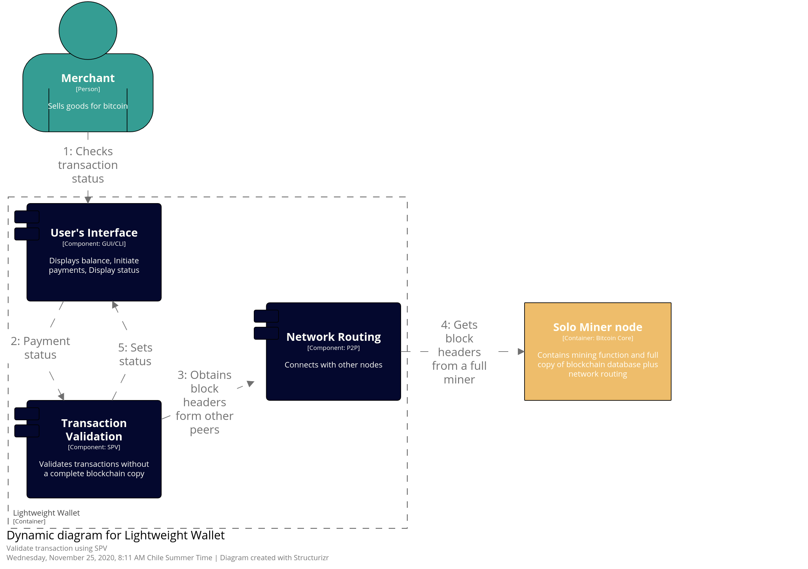

# Bitcoin - DeepDive

The term wallet may refer to the interface the layman user uses to track the money balance, manage keys/addresses and creating/signing transactions. 

## 1. Component diagram - Lightweight wallet

## 2. Workflows

### Buying goods with Bitcoin

This diagram shows how a normal person can buy physical or digital goods from a merchant using Bitcoin.

For example, someone can buy a latte from a coffee shop and choose to pay in bitcoins. In that case, the merchant gives the customer a Bitcoin address. The customer uses his android wallet software to sign a transaction with the correct amount (plus a fee) and the shop's owner address as receiver. The process of signing requires the private key related to the origin address. When the transaction is built it is broadcasted to other peers in the network. Finally, the merchant can check if the transaction is part of the blockchain and give the customer its latte, before it could get cold. 

### Verifying the validity of a transaction

### Creating a new address

