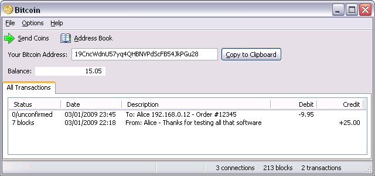
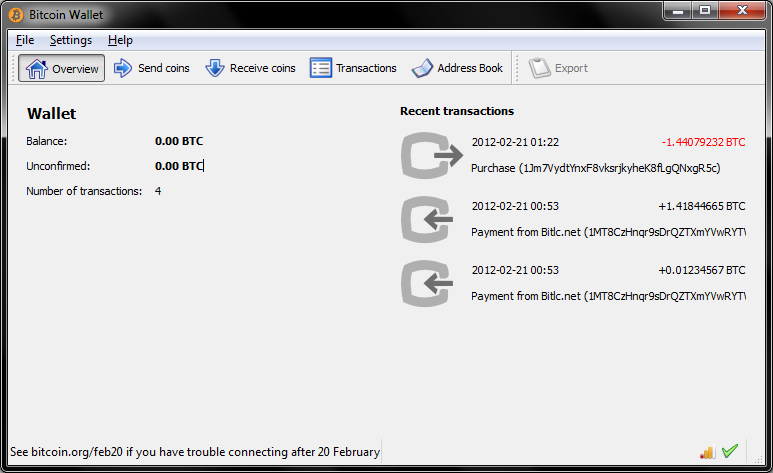
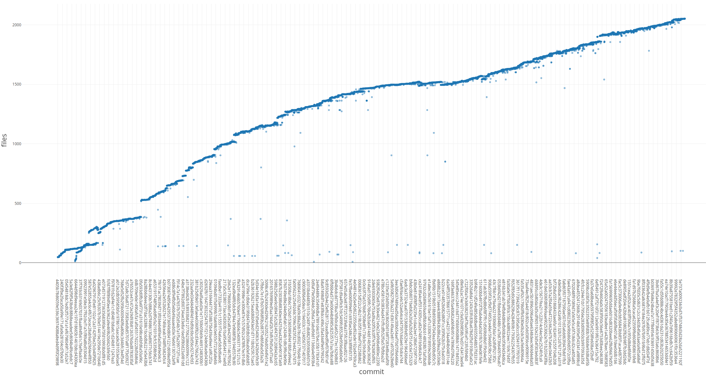

# Bitcoin - Evolution

## History and Evolution

At the end of 2008 a single person or a group of people under the name Satoshi Nakamoto released in a mailing list a paper describing an effective decentralized, peer-to-peer, electronic monetary system called Bitcoin. It was based on the proof of work algorithm Hashcash, but validating transaction without relying on a central authority. Miners solve a difficult mathematical problem and are rewarded with new coins on success.

On January 3rth of 2009, Satoshi mined the first 50 bitcoins and added the first batch of transactions (called block) to the "blockchain". After more than a decade of this event, the system has evolved dramatically, but its core ideas, features and characteristics are still there, making this cryptocurrency the most popular one.

Here we present the most notable changes between the first and current version, in terms of functionality, and a report on the number of files through each commit to the reference Bitcoin implementation, Bitcoin Core.

- First version v0.1.0

  - Full client, requiring the complete blockchain. 
  - No command line interface.
  - Windows only GUI (WinForms).
  - Pay to public key (P2PK)
- Current version

  - You can choose between full client or lightweight wallets (SPV).
  - RPC/REST/CLI. This allows the existence of SPV clients, mining pools,and others.
  - Qt GUI, cross-platform.
  - Supports *bitcoin:* URIs for payments.
  - Support for SegWit addresses.
  - P2PKH, P2PSH

**Figure 1**: First version GUI

**Figure 2:** Current version GUI

### Number of files per commit

Starting from the first commit (with 45 files) to the official repository until 66667acc (with 2052 files).

## Architecture Decision Records

The Bitcoin community introduce new features, changes and relevant information to the technology documenting the proposals through a standardized design document called "Bitcoin Improvement Proposal" (BIP). It contains precise technical specification of the attribute and a rationale for given feature.

All BIPs can be found [this repo](https://github.com/bitcoin/bips/blob/master/README.mediawiki).

###  [“BIP 21 - URI Scheme”](https://github.com/bitcoin/bips/blob/master/bip-0021.mediawiki)

> **Context**:
>
> - To increase the usability of Bitcoin and make it accessible to the layman user, an easy method of payment had to be envisioned. It’s needed that a user could just click a link or scan a qr code to start the process.
> - The method should be standard to work with any wallet. 
>
> **Decision**:
>
> - Use the *bitcoin:* URI with a defined schema that comply [RFC 3986](https://tools.ietf.org/html/rfc3986)
> - It should represent a one-time payment, not revealing personal information.
> - The URI scheme name should give a description if someone from outside sees it.
>
> **Status**: Active
>
> **Consequences**:
>
> - Since several clients already use a *bitcoin:* URI scheme similar to this one, a grace period of 6 months is given for developers to update their clients to comply.

### [“BIP 70 - Payment Protocol”](https://github.com/bitcoin/bips/blob/master/bip-0070.mediawiki)

> **Context**:
>
> - BIP 21 presented some security problems. A more secure method was needed to enable a better customer experience and security against man in the middle attacks on the payment process.
>
> **Decision**:
>
> - Payment protocol messages encoded using Google’s Protocol Buffers authenticated using 
> - Communicated over http/https.
> - Might extend this payment to other encoding, PLI systems or transport protocols.
>
> **Status**: Final
>
> **Consequences**:
>
> - There’s been some controversy over the idea that some entities provide a certificate that can validate payments, since this goes against the decentralization provided by Bitcoin, making the transaction process dependent on external, defined players.

 ### [“BIP 32 Hierarchical Deterministic Wallets”](https://github.com/bitcoin/bips/blob/master/bip-0032.mediawiki) 

> **Context**:
>
> - Losing a wallet means losing all the money it “holds”, a method to deterministically generate a wallet is needed. Also avoiding the necessity for a backup after every transaction without exposing the private keys.
> - The method should be standardized so that the deterministic wallet can be interchanged between different clients.
>
> **Decision**:
>
> - A method for deterministically generating the same keys every time the same seed us used is needed.
>
> **Status**: Final
>
> **Consequences**:
>
> - All wallets should use the same standard algorithm to enable wallet portability. 

### [“BIP 141 Segregated Witness (Consensus layer)”](https://github.com/bitcoin/bips/blob/master/bip-0009.mediawiki)

> **Context**:
>
> - In Bitcoin, every transaction input was followed by the witness data that contained signatures to enable unlocking it for spending. 
> - This opens the possibility for a malicious actor to modify the transaction, known as transaction malleability.
>
> **Decision**: 
>
> - It is needed a backwards-compatible architectural change to transactions that separates the witness data / signature into a separate data structure, creating a soft-fork.
> - It’s called Segregated Witness (SegWit)
>
> **Status**: Final
>
> **Consequences**:
>
> - No more transaction malleability attacks enable the implementation of new protocols like payment channels, chained transactions and lightning networks.
> - Witness data is usually large and moving it out of the way improves bitcoin's scalability.
> - Older wallets should be able to handle SegWit addresses.

### [“BIP 9 Version bits with timeout and delay”](https://github.com/bitcoin/bips/blob/master/bip-0009.mediawiki)

> **Context**:
>
> - A way of make changes and upgrades to Bitcoin without braking existing nodes is needed.
> - Multiple forks of Bitcoin should be able to coexist at the same time to allow gradual transitions to the new consensus.
>
> **Decision**:
>
> - Change how the version field in blocks is interpreted, allowing simpler soft fork deployment.
> - The version field should be interpreted as a bit vector, where each bit can be used to track an independent change. 
>
> **Status**: Final
>
> **Consequences**: 
>
> - Exists a standard to specify a description to each soft fork.
> - Miners have a limited time to activate upgrades.