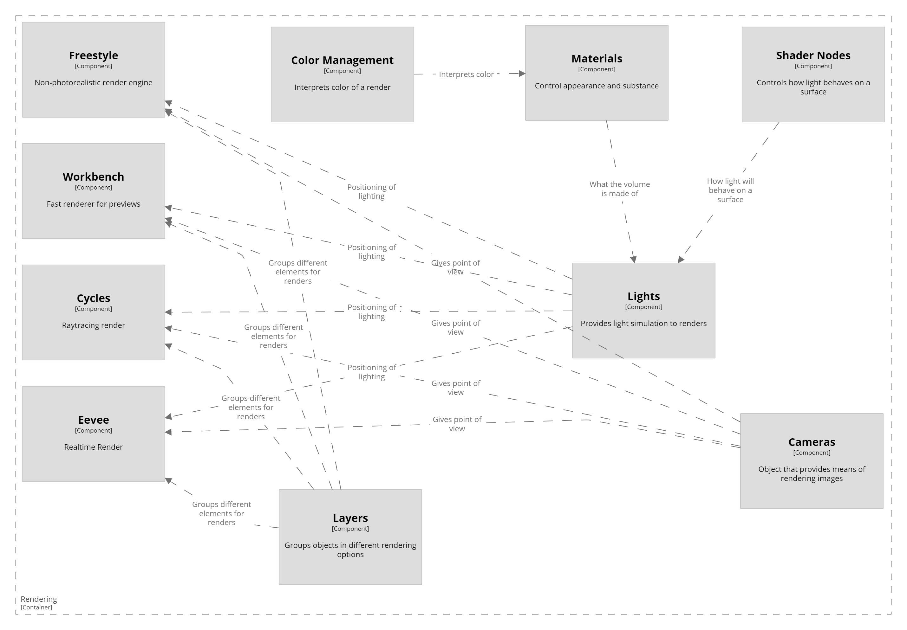

# Blender - DeepDive

## Blender Rendering

Blender counts with a variety of rendering options, the rendering process transforms a 3D scene into a 2D image. Each renderer has a different objective. 

### Eevee: 
The most recenltly incorporated engine, Eevee's strengths lie in it's realtime rendering capabilities and high realistic value on lower requierements than Cycles. 

### Cycles:
The prefered rendering option for finalizing a proyect, cycles is a physically based path tracer that is very precise and takes a long time to finish a render, however, it provides higher quality outputs. 

### Workbench:
Designed for previews, this is not a renderer used for finalizing proyects, only for a quick preview of what is being modeled. Renders very fast for low quality models.

### Freestyle:
An edge/line-based non-photorealistic renderer, this option is used for more "cartoon" or "anime" style art proyects. It has high memory demand as it loads all layers at once.

### Other Components:
The rest of the components provide settings for the renderer to use when calculating how the image with result in the end. In a sense, these all work for the different renderers in a similar fashion.

#### Layers:
A layer is what groups different objects in a scene to be rendered a certain way, all grouped objects in a layer recieve the same settings from the other components. 

#### Cameras: 
Provides the renderer with a point of view, a place from where an observer is standing.

#### Lights:
Provides with light settings to include points of light with different shapes and intensity to iluminate the scene, the shaders then indicate how light behaves when it hits a certain object.

#### Shader Nodes:
Shaders are settings on surfaces that add effect to light incoming to the object, they can give reflective appearance, blurred reflections, roughness and other texture simulations depending on the settings.

#### Materials:
Similar to shaders, materials also change how light behaves on an object, but this includes the volume of the object itself, it can be dull or transparent or have a certain texture.

#### Color Management:
Indicates what color the surface of a material is, renderers rely on this component to get the coloring right for the final result. 

