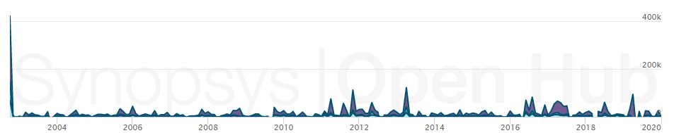

# Blender - Evolution

## History and Evolution

Blender started as an in-house 3d modeling program made by it's main developer Ton Roosendaal in 1995, in 1998 he founded a new company, Not a Number (NaN) to further develop Blender. After some problems during the early 2000s with NaN and it's investors, Ton founded a non-profit to continue developing Blender in March 2002. Blender has since been an open source 3D art and animation suite led by it's original creator. 

<strong>Blender 1.0: </strong> The initial program was a simple, yet functional and well written code in C. It acomplishes the task of making 3D objects in very basic ways, allowing for generic shapes and colors and animation. It allows for basic transformation of shapes, joining shapes, linking, and most tools for basic modeling, coloring and textures. All of blender was under the same process, all the thing mentioned before we made in the same batch of code, of the 9 files, only 2 had a significant amount of code, one was for the UI and the other is for functionality. 

<strong>Blender 2.90.1: </strong>Today Blender's core hasn't changed that much from the 1.0 verison, but it's surroundings have improved significantly. Now blender is not a single process that manages all aspects of 3D modeling, it uses separate sistems to render, model, texture, brush, animate and rig, and even python scripts and addons. An increasing number of transformations and all types of complicated 3D objects can now be made instantly on later versions of the program. Now allows for physics simulations, hair and fur rendering and lighting, just to name a few.

## Chart:

### Number of files on different versions:
| Version | Files |
|:-------:|:-----:|
|   1.0   |   9   |
|   1.73  |   21  |
|  1.80a  |   42  |
|   2.04  |   21  |
|   2.26  |   22  |
|   2.30  |   36  |
|   2.40  |  141  |
|   2.57  |  897  |
|   2.62  | 1,061 |
|   2.90   | 4,227 |

### Lines of code added:

## ADRs

### Title: Adding OpenGL 1.30

### Context:

 Blender seeks to increase it's options for 3D modeling and scuplting 

 Blender wants to work on any platform 

### Decision:

 We will include OpenGL's API to Blender functions across all platforms. 

### Status: Active

### Consequences:

 Blender has been using OpenGL for years, it continues to be a central part in the suite's modeling. 

### Title: Adding Eevee realtime renderer

### Context:

 Blender counts with a rendering program called Cycles, which is very good, but slow, they want a renderer that is faster and can work in realtime. 

### Decision:

 We will include Eevee renderer as a rendering option in the blender suite

### Status: Active

### Consequences:

 Eevee is a valuable option for lower end computers that have trouble rendering proyects 

### Title: Game Engine in 2.0

### Context:

 3D games are becoming more and more popular 

 The market for game engines is becoming big 

### Decision:

 We will adapt current blender 3D modeling power with game engine tecnology to attract new users.

### Status: Removed in 2.80

### Consequences:

 Game engine didn't work until 2.37 

 Removed in 2.8 in favor of future plans to remake engine with support from external engines like Godot.

### Title: Python Addons in 2.53

### Context:

 Every day users become more expert and require specialized tools 

 Developers who make scripts have to make an extra effort to apply them into blender. 

### Decision:

 A specofied Addon service will be offered, where common scripts will be available and custom scripts can be added to the main program of local machines.

### Status: Active but updated in 2.80

### Consequences:

 Developers have better access to apply their scripts. 

 Having python modules in one place mekes it easier to find the specific script you need.

### Title: 3D Audio in 2.60

### Context:

 Animations and videos were lacking good 3d audio. 

 Positional sounds could not exist in Blender. 

### Decision:

 Adding 3D audio and a speaker object that can be placed and positioned in the environment..

### Status: Active

### Consequences:

 Developers can now adjust the audio within the space. 

 Animations within blender became even more popular amongst artists.

