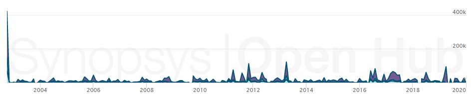

# Blender - Evolution

## History and Evolution

Blender started as an in-house 3d modeling program made by it's main developer Ton Roosendaal in 1995, in 1998 he founded a new company, Not a Number (NaN) to further develop Blender. After some problems during the early 2000s with NaN and it's investors, Ton founded a non-profit to continue developing Blender in March 2002. Blender has since been an open source 3D art and animation suite led by it's original creator. 

<strong>Blender 1.0: </strong> The initial program was a simple, yet functional and well written code in C. It acomplishes the task of making 3D objects in very basic ways, allowing for generic shapes and colors and animation. It allows for basic transformation of shapes, joining shapes, linking, and most tools for basic modeling, coloring and textures. All of blender was under the same process, all the thing mentioned before we made in the same batch of code, of the 9 files, only 2 had a significant amount of code, one was for the UI and the other is for functionality. 

<strong>Blender 2.90.1: </strong>Today Blender's core hasn't changed that much from the 1.0 verison, but it's surroundings have improved significantly. Now blender is not a single process that manages all aspects of 3D modeling, it uses separate sistems to render, model, texture, brush, animate and rig, and even python scripts and addons. An increasing number of transformations and all types of complicated 3D objects can now be made instantly on later versions of the program. Now allows for physics simulations, hair and fur rendering and lighting, just to name a few.

## Chart:

### Number of files on different versions:
| Version | Files |
|:-------:|:-----:|
|   1.0   |   9   |
|   1.73  |   21  |
|  1.80a  |   42  |
|   2.04  |   21  |
|   2.26  |   22  |
|   2.30  |   36  |
|   2.40  |  141  |
|   2.57  |  897  |
|   2.62  | 1,061 |
|   2.90   | 4,227 |

### Lines of code added:

