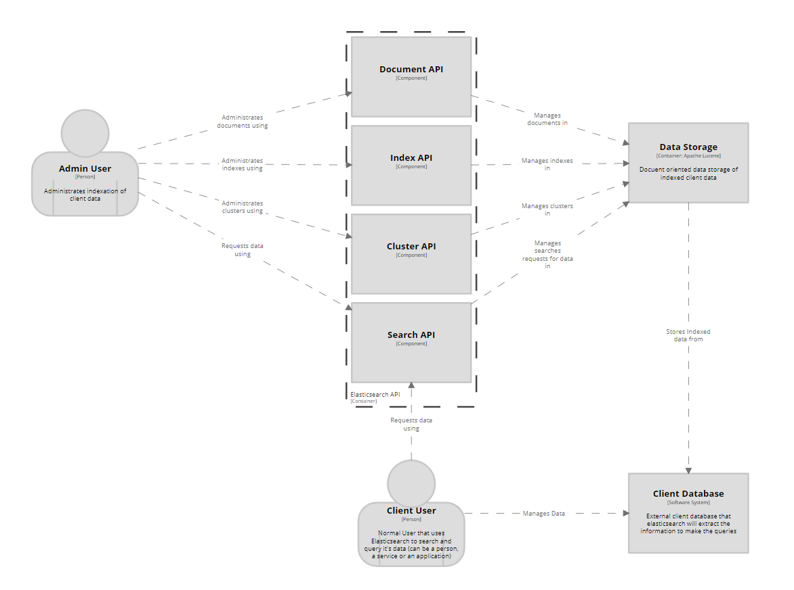
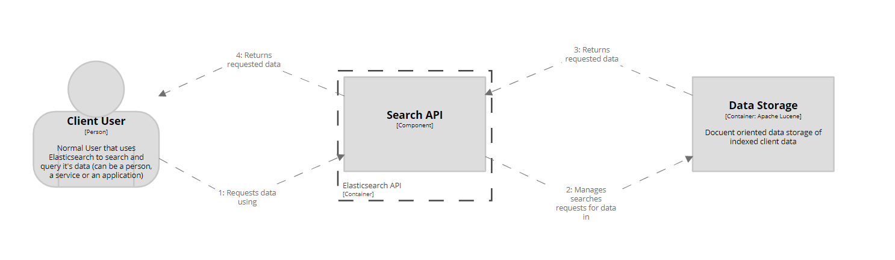
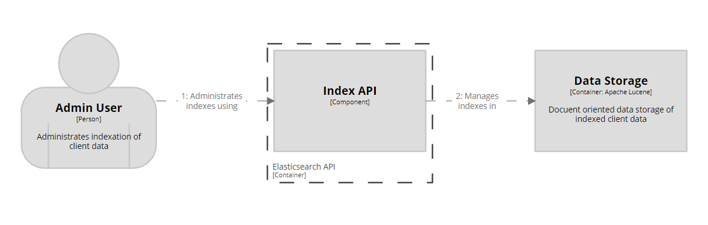
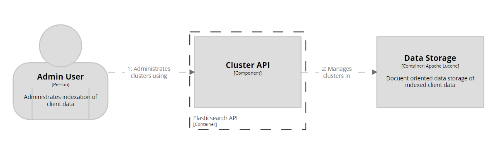

# ElasticSearch - DeepDive

## Component Diagram

### Elasticsearch API Component Diagram

The main RESTful API is divided in sections depending on the main focus of the operations: search, documents, clusters and indexes. Each one of these, except for search, has it's own set of functions following the RESTful structure. A client or admin user makes a request to the API. Depending on the category of the request, then it is derived to the corresponding API. If it is a get or search request, the API responds to the client.

There are a lot more APIs than the ones shown in the diagram, but to avoid saturation of information we decided to focus on four, three of which we made the dynamic diagramns shown below. All these APIs are:

+ cat APIs
+ Cluster APIs
+ Cross-cluster replication APIs
+ Data stream APIs
+ Document APIs
+ Enrich APIs
+ Graph Explore API
+ Index APIs
+ Index lifecycle management APIs
+ Ingest APIs
+ Info API
+ Licensing APIs
+ Machine learning anomaly detection APIs
+ Machine learning data frame analytics APIs
+ Migration APIs
+ Reload Search Analyzers API
+ Repositories Metering APIs
+ Rollup APIs
+ Search APIs
+ Searchable snapshots APIs
+ Security APIs
+ Snapshot and restore APIs
+ Snapshot lifecycle management APIs
+ Transform APIs
+ Usage API
+ Watcher APIs

These components are isolated from each other. Together they are the main way in which the Admin can configure the Data Storage and the Client can make search request - the RESTful Elasticsearch API, but each one of them covers different parts of the organization and functionalities in the Data Storage. This is the main focus of Elasticsearch: a search engine that enhance performance by having indexed data. 

## Workflows

All the communication between the APIs and the users are made through JSON files.

### Search API workflow

The Client User makes a request for data through the API. The API searches for this data in the Data Storage (which has the original client database data organized in documents and indexed by the Admin User). The Data Storage responds with the data, which is presented by the API to the Client User.

### Index API workflow

The Admin User creates, update, deletes or makes any other action over the indexes in the Data Storage. The User can request these actions through the Index API, which then apply these changes on the Data Storage.

### Cluster API workflow

Through the Cluster API, the Admin User can manage the clusters and nodes in the Data Storage. The User makes a request for these actions through the Cluster API, which then apply these changes on the Data Storage.

For more information about the Elasticsearch API, visit https://www.elastic.co/guide/en/elasticsearch/reference/master/rest-apis.html
