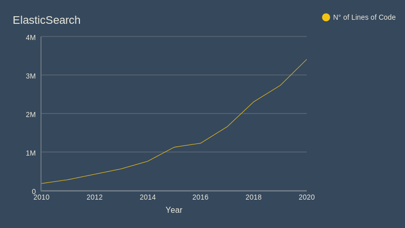

# ElasticSearch - Evolution

## 1. History and Evolution

### 1.1 Main Functional Differences

Even from the begining, Elasticsearch was a search engine with different features:

+ Distributed and Highly Available Search Engine.
  + Each index is fully sharded with a configurable number of shards.
  + Each shard can have one or more backups.
  + Read / Search operations performed on either primary or backup shards.
+ Multi Tenant with Multi Types.
  + Support for more than one index.
  + Support for more than one type per index.
  + Index level configuration (number of shards, index storage, …).
+ Various set of APIs
  + HTTP RESTful API
  + Native Java API.
  + All APIs perform automatic node operation rerouting.
+ Document oriented
  + No need for upfront schema definition.
  + Schema can be defined per type for customization of the indexing process.
+ Reliable, Asynchronous Write Behind for long term persistency.
+ (Near) Real Time Search.
+ Built on top of Lucene
  + Each shard is a fully functional Lucene index
  + All the power of Lucene easily exposed through simple configuration / plugins.
+ Per operation consistency
  + Single document level operations are atomic, consistent, isolated and durable.
+ Open Source under Apache 2 License.

And now, it hasn't really change it's main functionality, but has added quality ones. The list of actual features is the next one:

+ Scalability and resiliency
  + Clustering and high availability
  + Automatic node recovery
  + Automatic data rebalancing
  + Horizontal scalability
  + Rack awareness
  + Cross-cluster replication
  + Cross-datacenter replication
+ Management
  + Index lifecycle management
  + Hot-warm architecture
  + Frozen indices
  + Snapshot lifecycle management
  + Snapshot and restore
  + Source-only snapshots
  + Data rollups
  + Data streams
  + Transforms
  + Upgrade Assistant API
  + API key management
+ Security
  + Elasticsearch secure settings
  + Encrypted communications
  + Encryption at rest support
  + Role-based access control (RBAC)
  + Attribute-based access control (ABAC)
  + Field- and document-level security
  + Audit logging
  + IP filtering
  + Security realms
  + Single sign-on (SSO)
  + Third-party security integration
+ Alerting
  + Highly available, scalable alerting
  + Notifications via email, Slack, PagerDuty, ServiceNow, or webhooks
+ Clients
  + Language clients
  + Elasticsearch DSL
  + Elasticsearch SQL
  + Event Query Language (EQL)
  + JDBC client
  + ODBC client
  + Tableau Connector for Elasticsearch
  + CLI tools
+ REST APIs
  + Document APIs
  + Search APIs
  + Aggregations APIs
  + Ingest APIs
  + Management APIs
+ Integrartions
  + Elasticsearch-Hadoop
  + Apache Hive
  + Apache Pig
  + Apache Spark
  + Apache Storm
  + Business intelligence (BI)
  + Plugins and integrations
+ Deployment
  + Download and install
  + Elastic Cloud
  + Elastic Cloud Enterprise
  + Elastic Cloud on Kubernetes
  + Helm Charts
  + Docker containerization
  
### 1.2 Evolution in Numbers

For the following Charts, the following versions of the ElasticSearch repository were used (with their corresponding attributes):

+ v0.4 (2010)
  + Files: 1.350
  + Lines of Code: 181.946
  + Commit: b3337c312765e51cec7bde5883bbc0a08f56fb65
+ v0.15 (2011)
  + Files: 2.329
  + Lines of Code: 280.801
  + Commit: dac2a888fbd4a1fbff50efe3d6600ce2ed0bb95b
+ v0.90 GA (2013)
  + Files: 2.957
  + Lines of Code: 561.527
  + Commit: cb75ce0caa65af294167ae0d1514deec7815431b
+ v1.0.0 (2014)
  + Files: 4.501
  + Lines of Code: 758.745
  + Commit: a46900e9c72c0a623d71b54016357d5f94c8ea32
+ v2.0.0-beta1 (2015)
  + Files: 6.027
  + Lines of Code: 1.123.593
  + Commit: bfa3e47383d0adc690329a2fa1094ceb64cae651
+ v2.3.5 (2016)
  + Files: 6.492
  + Lines of Code: 1.229.010
  + Commit: 90f439ff60a3c0f497f91663701e64ccd01edbb4
+ v5.5.0 (2017)
  + Files: 8.796
  + Lines of Code: 1.657.088
  + Commit: 260387d2e4c0422c00adb04d160690ed1da05209
+ v6.4.0 (2018)
  + Files: 13.292
  + Lines of Code: 2.303.684
  + Commit: 595516e45d054483dcdaf12f0468a59cb34bb568
+ v6.8.5 (2019)
  + Files: 15.868
  + Lines of Code: 2.729.228
  + Commit: 78990e93431aebcc3dcd7fa20fab4b5b29ab7988
+ v7.9.3 Last GitHub Build (2020)
  + Files: 20.022
  + Lines of Code: 3.406.533
  + Commit: c4138e51121ef06a6404866cddc601906fe5c868
  

  
## 2. Architecture Decision Records

### ADR1: Apache Lucene as base search software
*Context:* (1st commit)

+ An esqueleton es needed to develop the software
+ Apache Lucene is a search software, that includes Lucene Core (Java library with indexing and search features) and Solr, a search server.

*Decision:* Use Apache Lucene as the base software for the Elasticsearch project

*Status:* Active

*Consequences:* 10 years after, it is still the base software used by ElasticSearch. Easy to use and construct over it.

### ADR2: Implement Hamcrest matcher library
*Context:* (1st commit)

+ Because ElasticSearch is a small software, it can use external libraries for complex algorithms without losing performance.
+ Hamcrest provides a matcher for different types of data structures (from simple text to collections and objects).

*Decision:* Use the Hamcrest library to find matching results to the query.

*Status:* Active

*Consequences:* In the begining, it was a good tool for a much smaller software like what ElasticSearch was 10 years ago. Today Hamcrest is mainly used in testing, where the performance is not important.

### ADR3: Use Google Collect
*Context:* (1st commit)

+ Google Collect provides different tools and functions to make it easy to program in Java.

*Decision:* Use the Google Collect library for different purposes in code.

*Status:* Active

*Consequences:* Google Collect changed it's name and now is Guava, but the tool is still used in different parts of the software.

