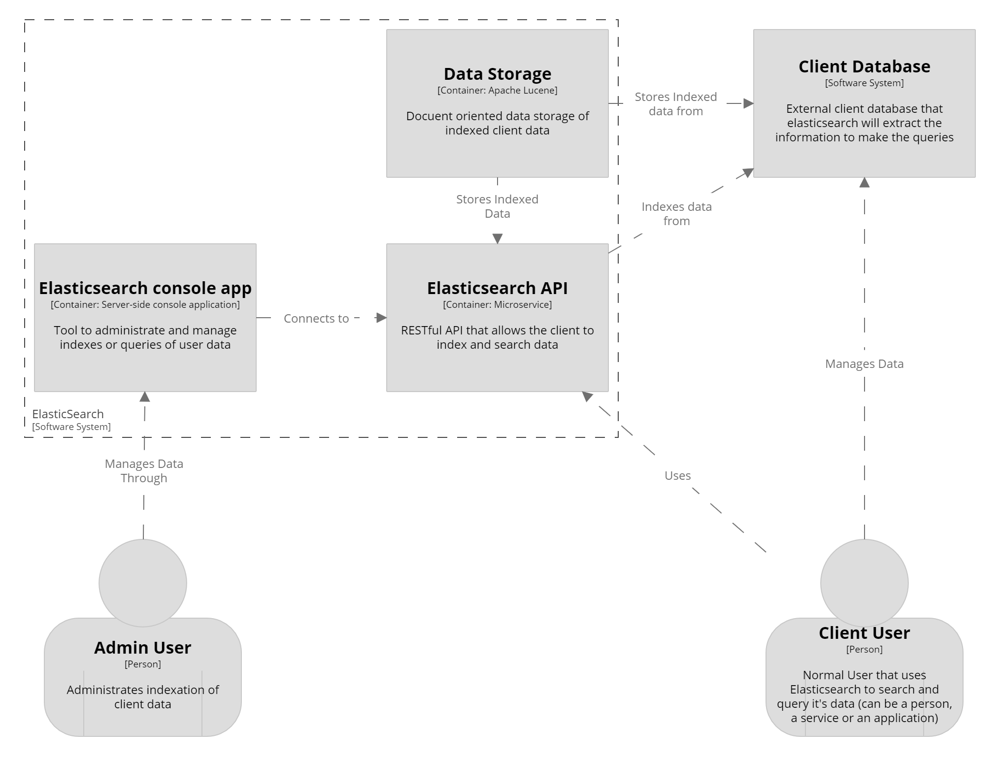

# ElasticSearch - Overview

## Description

Elasticsearch is a RESTful API, a real-time distributed search and analytics engine with high availability. It is used for full-text search, structured search, analytics, or all three in combination.
The client can index the data, meaning that Elasticsearch indexes it in the document-oriented data store (based in Apache Lucene). 
The client can also use this datastore as it primary database. Then, the client can search in the indexed data through JSONs queries.
There are two types of users: the administrator user, who configures it and indexes the data, and sets who the search client is. Then the main user is the search client, who uses Elasticsearch as the search engine it is. 
This client may not necessarily be a person, as it Elasticsearch is meant to be used by other applications and services.

## Visualization
### Container Diagram

### Context Diagram

## Quality Attrbiutes

- Availability: The main QA which with the Elasticsearch page describes itself. The whole architecture is design around this idea, meaning that the system never collapses from high workload. The client must be able to connect from differents points at the same time, making queries of different answer sizes, and the service must always be available and respond accordingly.

Scenario: A user makes a query at the peak hour for queries in the busiest day of the month; the system keeps working normally and responds to the query accordingly with no downtime.
1. Source: User
2. Stimulus: Query by the user
3. Artifact: Data Storage
4. Environment: Peak hour in the busiest day of the month
5. Response: Continue to operate; returns successful response
6. Response measure: No downtime

- Robustness/Reliability: It is expected that the service never fails. If something unexpected happens inside or outside the system, Elasticsearch can still perform the queries and return the correct answers.

Scenario: A user makes a corrupted query, using a wrong format in the JSON. The systems respond with an error message and keeps working normally.
1. Source: User
2. Stimulus: Query by the user
3. Artifact: API
4. Environment: Wrong query formatting on the client side
5. Response: Continue to operate; returns error message
6. Response measure: No system failure

- Performance: It is expected that the speed in which the service answers the queries is fast enough to mantain the quality of the client experience.

Scenario: A user makes a complex query that would take a lot of resources to complete. The user recieves the correct answer in an acceptable time period.
1. Source: User
2. Stimulus: Query by the user
3. Artifact: Storage Data
4. Environment: Complex query 
5. Response: Returns correct answer
6. Response measure: Acceptable time period.
