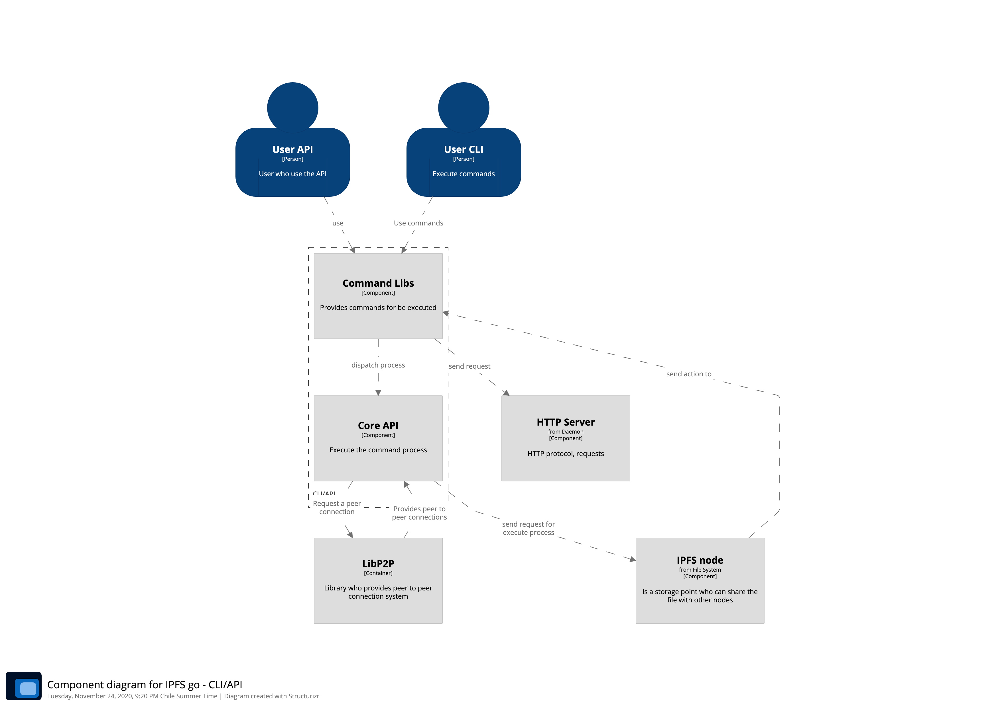
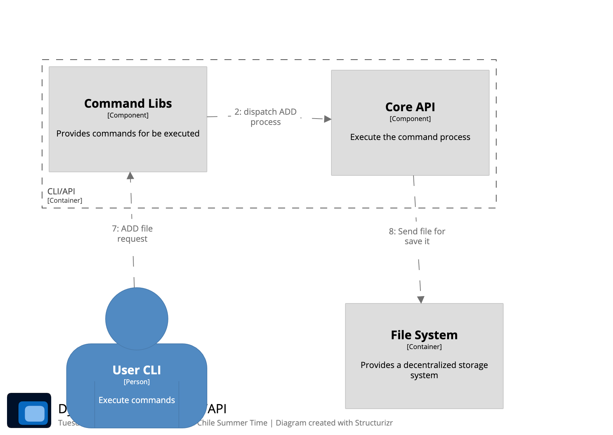
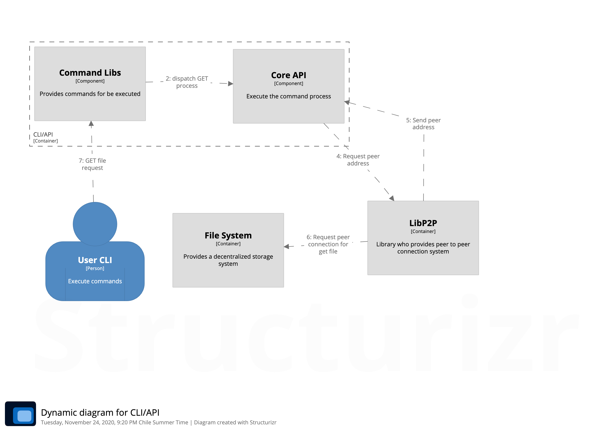
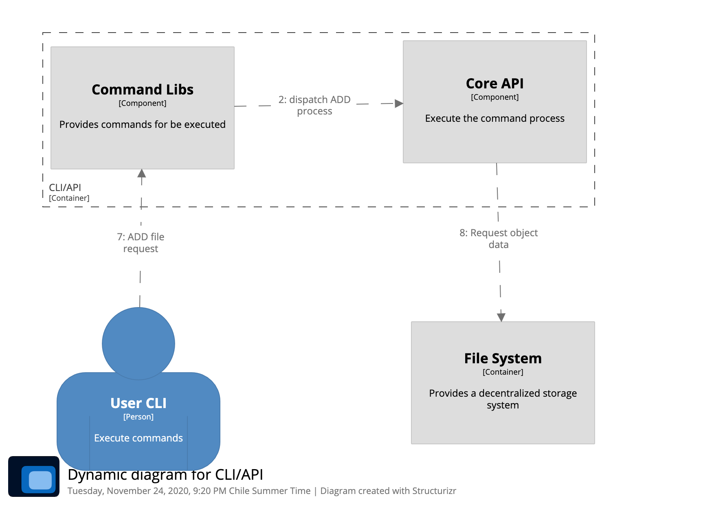

# IPFS - DeepDive

The principal functionality provides a peer connection to get and add files into the IPFS system. The CLI and API is relevant because this provides an interface for user interaction adding, removing, requesting and many other actions with IPFS files and nodes, without this container basically you couldn't be able to interact with IPFS.

## Workflows

### Add a file
With this workflow users can add files to IPFS network using commands.

### Get file
With this workflow users can request files to IPFS and receive its, download or just see them.

### Cat file
With this workflow the user can see the data of a IPFS file in offline mode.
