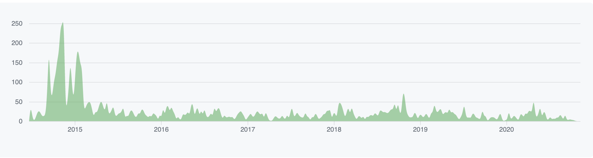
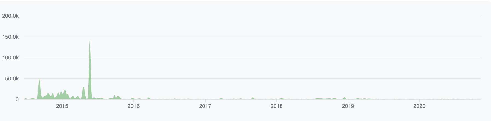
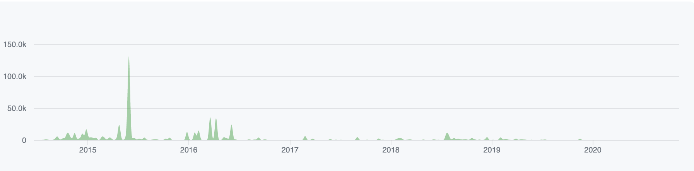

# IPFS - Evolution

The IPFS project was born in 2013 by Juan Benet,  Juan  known Git's data-linking structure is useful across many data types–not just code. Juan recognized that combining this concept with the P2P file-sharing structure of BitTorrent would be powerful: functional, secure information sharing without centralized barriers. This could transform the world far beyond scientific datasets.
the IPFS whitepaper was published in july 2014 and it caught the attention of many enthusiastis people. the contributors worked nigth, weekends and initally for free because they believed in the positive impact that open networks like IPFS could have on the world. The next year IPFS team was growing to get a cowroking space in Seattle to implement and release the go-ipfs in April 2016. The improvements of 0.4.0 transitioned IPFS from an "exciting demo" to a genuinely useful tool for early adopters. In 2018 IPFS entered the next phases of its maturation. the project neede to deliver on its ideological ans technica advantages at scale. IPFS has come a long way in the journey to building a faster, safer, and more open web to preserve and grow humanity's knowledge.
the main difference of evolution of the first release to the newest are the speed to add a file, to provide, to find and fetching files. In 2016 IPFS got the first release with a few things comparing now, in this case the most important diferences are: the security of files, the usability of IPFS and the control of the network system.

## Lines of code added and removed
Commits

Aditions

Deletions

# ADR 1: New DHT - Release 0.5.0

## Context

- Actual DHT have problems trying to connect to peers that cannot be reached wasting query time.
- The logic of DHT query doesn't properly terminate when it hits the end of the query, trying always to reconnect.
- The routing table are poorly maintened
  
## Decision

- Dual DHT
  - All IPFS nodes will now run two DHTs: one for the public internet WAN, and one for their local network LAN.

- Query Logic
  - Improove the DHT query logic to more closely follow Kademlia. This should significantly speed up:
    - Publishing IPNS & provider records.
    - Resolving IPNS addresses.
- Routing Tables
  - Addresing the poorly maintained routing tables by:

  - Reducing the likelihood that the connection manager will kill connections to peers in the routing table.
  - Keeping peers in the routing table, even if we get disconnected from them.
  - Actively and frequently querying the DHT to keep our routing table full.
  - Prioritizing useful peers that respond to queries quickly.
## Status

Verified

## Consequences

A lot of cost wasted rewriting the most of the module DHT

# ADR 2: QUIC by default - Release 0.6.0

## Context

- QUIC transport is enabled by default for both inbound and outbound connections. When connecting to new peers, libp2p will continue to dial all advertised addresses in parallel (tcp + quic), so if the QUIC connection fails, the connection should still succeed.

## Decision

- With the QUIC transport, the IPFS handshake takes two round trips. In the future, this will be improved for reduce it to one round trip.
- The QUIC transport will open one UDP socket per listen address instead of one socket per connection.
  

## Status

Implemented

## Consequences

- Have to make two round trips for establish a connection and the handshake, this should be improved to one round trip. 

# Removing support for the SECIO security transport - Release 0.7.0

## Context

SECIO is a TLS-like security transport and has been the main security transport for all libp2p implementations. The problem is now browsers are introducing support for TLS1.3 and not all libp2p implementation can make it the default security transport.

## Decision

- Implement [Noise security transport](https://github.com/libp2p/specs/tree/master/noise) as the main security transport method.

## Status

Deprecated

## Consequences

- Older nodes on the network that only support SECIO will no longer be able to communicate with IPFS nodes after 0.7

# ADR 3: QUIC - Release 0.4.18

## Context

- QUIC is a new UDP-based network transport, can share a single file descriptor between all connections. This release has introduced experimental support for the QUIC protocol.

## Decision

- Implement QUIC as a new protocol to solve issues with TCP.

## Status

Implemented

## Consequences

- Fewer local resources: allow us to dial faster and keep more connections open.
- Faster connection establishment: significantly reduce the latency of DHT queries.
- Behaves better on lossy networks: QUIC handles multiplexing internally, dropping a single packets affects only the related stream.
- Better NAT traversal: NAT hole-punching is significantly easier and, in many cases, more reliable with UDP than with TCP.

# ADR 4: Performance - Release 0.4.18

## Context

- Actual the resource of utlization are a problem when it use the IPFS becouse the IPFS use alot of CPU and memory.

## Decision

- Changed two of our most frequently used datastructures, CIDs and Multiaddrs, to reduce allocation load.
- Store CIDs encode as strings, instead of decoded in structs.
- Changed many of our multiaddr parsing/processing/formatting functions to allocate less.

## Status

- Implemented

## Consequences

- Reduce CPU utilization when heavily using the DHT.
- Improve memory usage when inserting CID.

