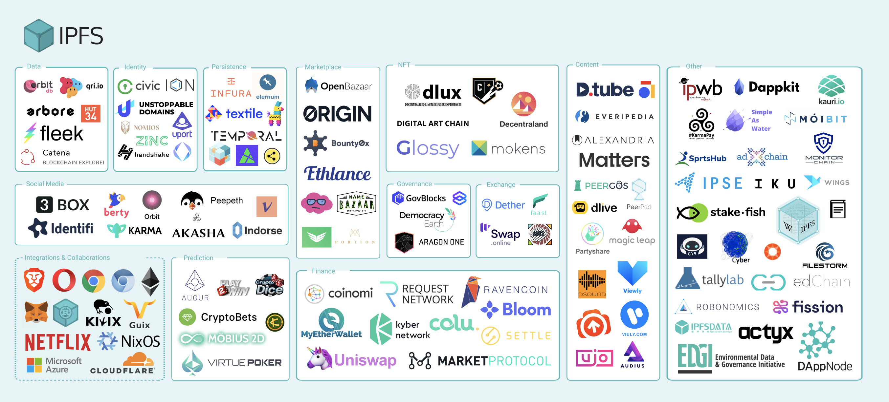
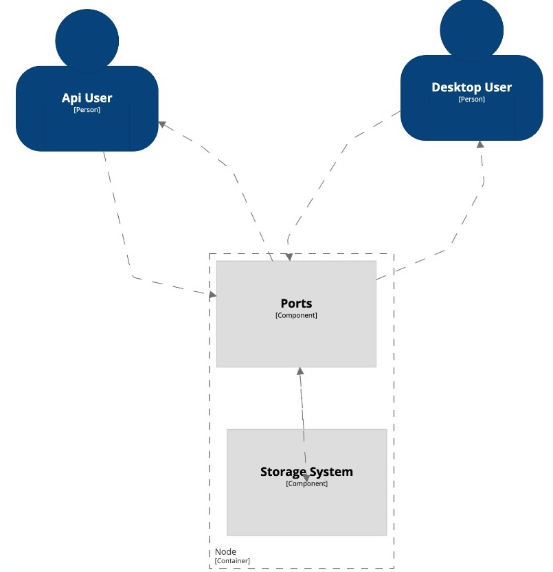
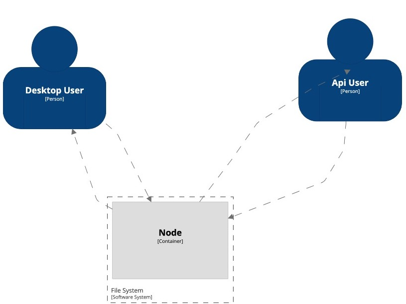

# IPFS - Overview

## Description

The InterPlanetary File System (IPFS) is a peer-to-peer
distributed file system that seeks to connect all computing devices with the same system of files. In other words, IPFS provides a high throughput content-addressed block storage model, with contentaddressed hyper links.

This forms a generalized Merkle DAG, a data structure upon which one can build versioned file systems, blockchains, and even a Permanent Web. IPFS combines a distributed hashtable, an incentivized block exchange, and a self-certifying namespace.

In this System existem two types of users: System integration users(SIU) and desktop users(DU).

IPFS is a versatile technology and can be used in a huge array of use-cases:

**Share Files**: sharing files between peers, that enables you to send your pictures, documents, files to your contacts privately and without limits.

**Colaborate**: Let IPFS coordinate the flow of data between you and your colleagues, even when working offline or on a local network.

**Store Assets**: By storing small scripts or big databases of their project on IPFS, and depending on their architecture, users can yield several benefits. Users will seed the content their use, decreasing the workload on their infrastructure, increase uptime of the service in case they go offline. The users also won't contact their servers for the content they already have.

**IPFS as infrastructure**: Using IPFS allows users to abstract away a lot of the complexity of coordination between machines. No matter their architecture IPFS handles load balancing, de-duplication, caching, and high availability out-of-the-box.

**Decentralize data**: the users increase availability in case the server runs into an issue. They will also decrease the load time for their swarm-connected users, and natively enable your app to work offline or on local networks. Depending on your app, the users can also reduce their storage requirements and download time thanks to native de-duplication and caching.

**Blockchain**: Thanks to content addressing, the blockchain only needs to store the IPFS multihash, and users are sure to fetch correct data from any of their peers.

**Decentralized Identity**: users storing all personal data on their devices rather than let every service use store a partial copy of it. Users having control of their data means that they decide which app has access to what, that they only fill your information once, and that they can revoke access.

In this image have all applications that works with IPFS

## Visualization

## Quality Attributes

### 1. Performance: 

IPFS provides a system making possible connect to many computers to get differents part of a file helping distribute efficiently high volumes of data without duplication.

1. Scenario description: a user of IPFS downling a high quality video.

2. Source: IPFS desktop user.

3. Stimulus/Event: user download a video from IPFS desktop.

4. Artifact: IPFS desktop

5. Environment: normal operation

6. Response: quick video download from differents IPFS nodes.

7. Response measure: fast and interrupted video download.

### 2. Robustness: 

IPFS keeps every version of your files and makes it simple to set up resilient networks for mirroring data.

1. Scenario description: a user who looks for a version of his file.

2. Source: IPFS cli user.

3. Stimulus/Event: user requesting a specific file version.

4. Artifact: IPFS cli

5. Environment: normal operation

6. Response: the needed file.

7. Response measure: The file is provided.

### 3. Availability: 

IPFS powers the creation of diversely resilient networks that enable persistent availability.

1. Scenario description: user requesting restaurant menu with a poor mobile plan at last month day.

2. Source: IPFS system.

3. Stimulus/Event: user requesting a file.

4. Artifact: IPFS system

5. Environment: normal operation

6. Response: the restaurant menu.

7. Response measure: Even with bad connections the file is available.

