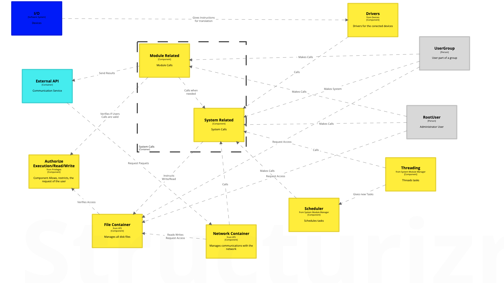
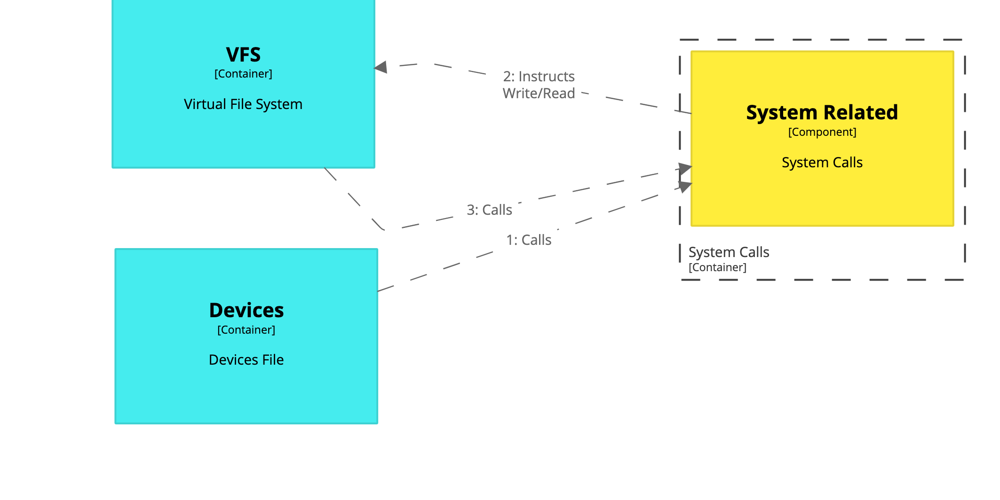

# Linux - DeepDive

## Component Diagram

The System Calls Module, it's one of the  most important Containers of the Linux Kernel, this is because, it allows the execution of CPU, Memory instructions, and other I/O devices. This container has two important components, which are
System Calls, and Module Calls. Module calls is the responsible for all devices/modules instructions, such as draw in screen, move cursor/pointer, etc...And System calls is in charge of every CPU/Memory required call(although for memory instructions some Module calls might be needed). So, in this context when some program needs to execute some work, it will eventually pass through a System/Module Call. When a user, calls for a copy in a drive, the I/O device sends it's data, the device module translates the command into kernel instructions, the Privileges Module approves or denies the execution and then the System/Module calls are executed if the approval was successful.

## Workflow

The System Related Workflow with the devices Container works as follow. The Device Container receives data, this data gets translated into actions, each action is a module/system call, then the Device Container makes the relevant calls to the System Container. The System Container responds each call (previously, the first time the device is installed it needs to be approved by the Privilege Container) and makes the corresponding file adjustments. In Linux everything is treated as a file. Subsequently, if a call is to execute some program, the System must instruct which file(s) to run/modify. The System Container must call the VFS Container, and this responds with the alteration to the files, if it was successful or not, and/or the instructions that need to be run by the execution instruction. 

