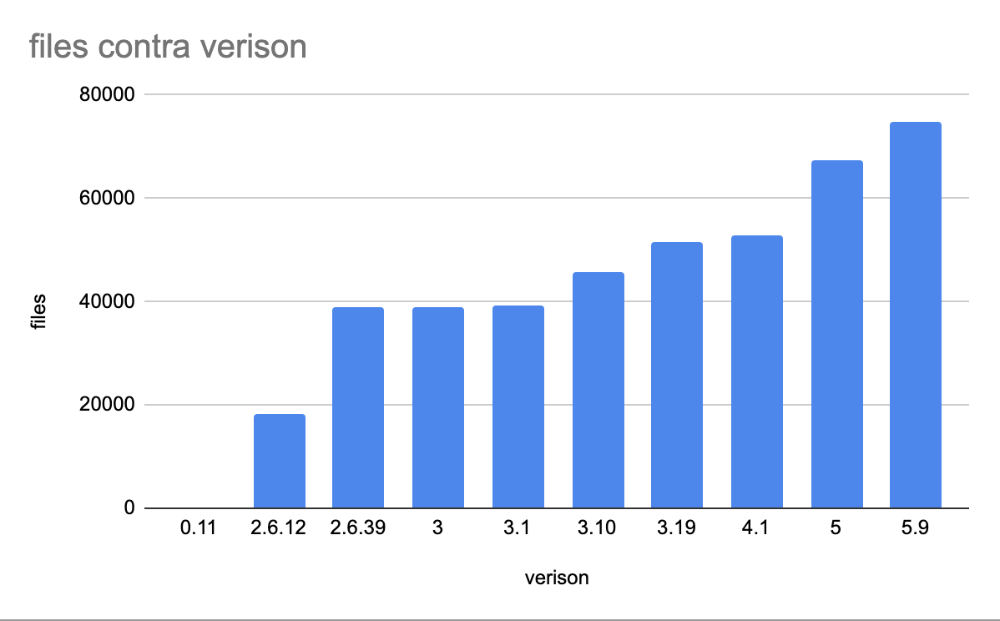

# Linux - Evolution

## History and Evolution

Linux Kernel main differences among the first commit and the latest one, is that the first it's main purpose is
for testing and no other "commercial" use, unlike the current version, which is available and stable. 29 Years after the first release, other changes are, for the 0.11 version the system must have at least 4mb of RAM, a 32 bit 
computer. On the Software side, the newer version can manage multiple filesystem types, like ntfs, ext, btrfs, as opposed to the first one, which only supported ext filesystem. This one also supported only 3 keyboard. In summary, 
the original spirit of the kernel remains the same, and it has been boosted with new technology, compatibility, and numerous new functions, among other things.

## Evolution Chart

## Architecture Decision Records

1. **Title:** ADR 1: Greybus Support for version 4.9
    1. **Context:** Greybus is intended for mobile modularity leaded by Project Ara. Google cancelled the project. Greybus is a container within the Kernel, which allows the execution of Project Ara(A mobile oriented Google Environment) execution calls.
    The Greybus support seems useless without Project Ara.
    1. **Decision:** Continue development on Greybus support.
    1. **Status:** Implemented, and added to the version 4.9-5.10-rc1-HEAD
    1. **Consequences:** Although, Project Ara was cancelled, Greybus is used in Android smartphones. Android calls this execution commands directly, without Ara's interface.

1. **Title:** ADR 2: Ext4 Support v.2.6
    1. **Context:** New filesystem type update, ext4.
    1. **Decision:** Support this new filesystem update.
    1. **Status:** Implemented.
    1. **Consequences:** Updated, to the latest release of the kernel with updates, Linux now supports ext4 filesystem update.

1. **Title:** ADR 3: Android Driver v2.6.33
    1. **Context:** Google's Android OS, Google is not working well with Linux, not contributing to the kernel.
    Original coders are no longer interested in maintaining the driver. The driver allows Android devices to make easier sysCalls and functions.
    1. **Decision:** Remove the driver from the source code.
    1. **Status:** Removed.
    1. **Consequences:** Google has to adapt their OS to the Linux kernel. 

1. **Title:** ADR 4: Fast Open TCP, v3.6
    1. **Context:** Faster http connection establishment.
    1. **Decision:** Client support of TCP fast open or TFO.
    1. **Status:** Implemented and Updated.
    1. **Consequences:** v3.7 includes Server side TFO support.

1. **Title:** ADR 5: Securing virtual memory v5.10
    1. **Context:**  Common Vulnerabilities and Exposures detailed security issues with the instruction set_fs().
    Virtual memory breached by this call, used on x86 systems. This call modified the address limit, and between two calls to this function, the user could kill the second one before it executed, and leave kernel memory open to the user.
    1. **Decision:** Modify set_fs() actions 
    1. **Status:** Implemented/Deleted
    1. **Consequences:** Instruction deleted for most architectures, still available for some old architectures, with it's breaches fixed. This architectures depend on this call, so if it was completely removed, the keenel won't work on that architecture.

