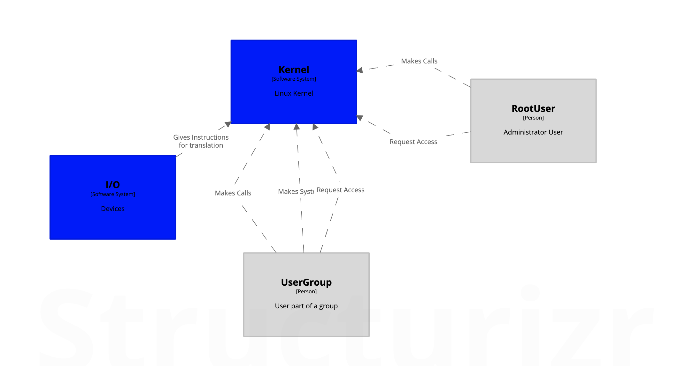

# Linux - Overview

## Description

Linux Kernel is a world wide used an known OS kernel. This software provides basic management for the components of a computer and the communication with the users. Providing a secure use and access for each component, hardware or human. It manages this by treating everything (in the software side) as a file, and each file has permissions for writing, reading, executing, among others.

## Visualization

## Quality Attributes

1. **Availability** A pack of tasks arrive, and they need to be resolved fast.
    1. **Scenario description:** Users/Modules are making system calls.
    1. **Source:** Module.
    1. **Stimulus:** Finish task X.
    1. **Artifact:** System.
    1. **Environment:** Heavy traffic.
    1. **Response:** Solve task X.
    1. **Response Measure:** No hanging time.
1. **Security.** Program needs to read a file.
    1. **Scenario description:** Program needs a constant unmodified file with it's values.
    1. **Source:** Executable.
    1. **Stimulus:** Read a file.
    1. **Artifact:** System.
    1. **Environment:** Normal Environment.
    1. **Response:** No reads/writes allowed on that file.
    1. **Response Measure:** Continuous and reliable system function.
1. **Usability:** User needs to read a file
    1. **Scenario description:** User access the system and tries to read the file.
    1. **Source:** User.
    1. **Stimulus:** Show file contents.
    1. **Artifact:** System.
    1. **Environment:** Normal environment.
    1. **Response:** Show the file contents.
    1. **Response Measure:** Open the file, if the user meets the permissions.
