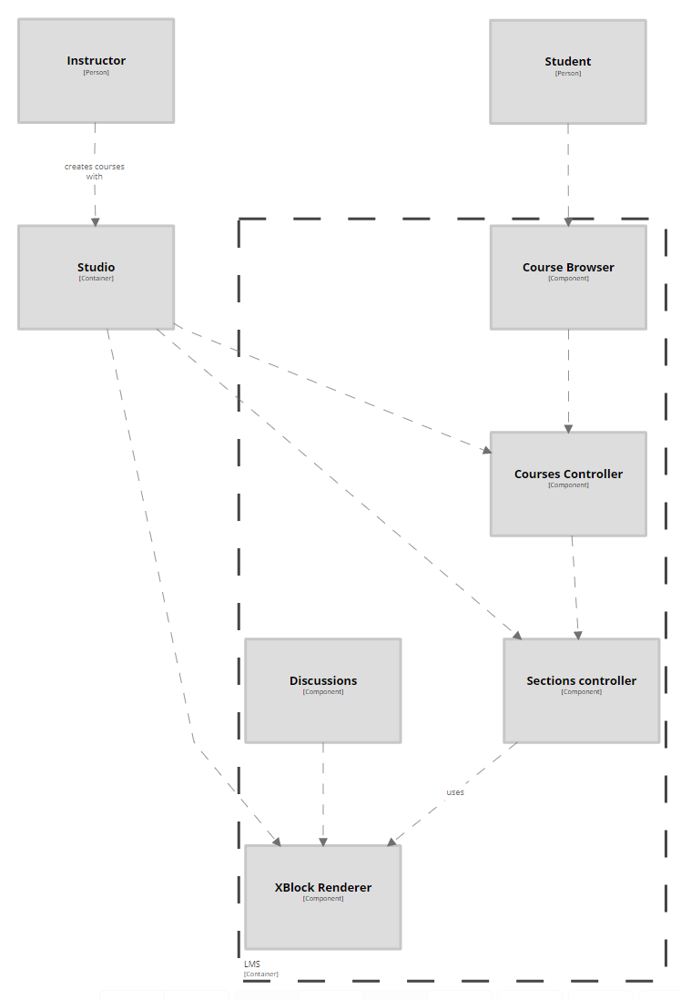
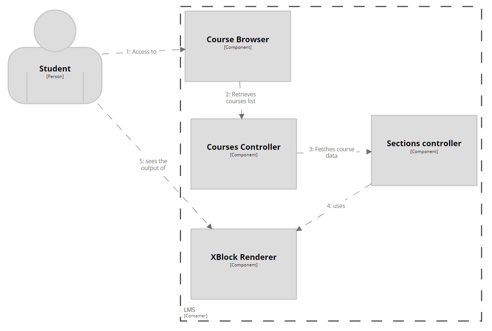

# OpenEdx - DeepDive

One of the core containers of OpenEdx is the LMS (Learning Management System). The most essential feature for Edx is the component that allow users to explore courses, study and learn. Through the LMS Container, several components such as XBlock Renderer allows to show XBlock-formatted course data in a given course sections and sub-sections.

The design of the courses itselves and their XBlocks content is done on Studio component, which is dedicated to educational content and course creation.

## Component Diagram

## Relevant Workflows

### Students uses course material
In order to access course materials, an student must get to the course browser in the Edx portal. From that point the user will be able to see the courses that already have access (or in 'enrolled' status on project's terminology) along other courses. Each course will show a sections index, which at the same time may have subsections. Each section or subsection should be composed of a single or several XBlocks which contain the course material, along other functionalities such as a discussion board for a certain topic.

### TODO (@barracius): Student sends comment through xblock-inserted discussion box

### TODO (@barracius): Instructor creates course
