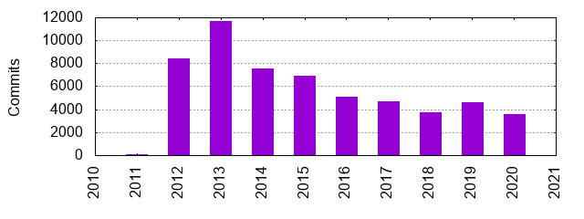
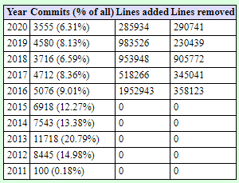

# OpenEdx - Evolution
edX was founded as a non-profit organization, product of a joint venture between MIT and Harvard University in 2012 with a seed fund of 60 million dollars.

To date, ten major releases have been produced from this open-source effort and today is one of the biggest and most successful Learning Management Systems (LMS) available on market.

Each of this releases offers new IDAs (major functionalities), which have been developed apart of the main monolith (edx-platform) as microservices.

##

## ADRs

### ADR 1: Use named releases

**Context:** OpenEdx development is advancing at a fast pace, introducing potentially breaking changes with frequency.

Deployments are increasing across the globe and administrators need to maintain and update their platform with compatible upgrades.

**Decision:** We will adopt a versioning scheme consisting of named major releases to help administrators and developers to focus on compatible software versions. 

Each named release will freeze the codebase and tools will be provided for each major version.

**Status:** accepted

**Consequences:** Now maintaining older deployments is easier thanks to available tools to test and deploy each major version even if it becomes outdated due to new features being implemented at the main branch.

Due to feature freezing, the delivery of new features into major versions would take a significant delay as they will be scheduled for the next major version release.

### ADR 2: Adopt a custom course design format (XBlock)

**Context:** In a learning management system some non-technical users create courses and have to implement simple to complex interaction methods in their course material.

Mixing code and content during course design might complicate the process also restricting the possibilities of creating interactive learning experiences.

**Decision:** We will implement a novel modular course design system that allows developers to design simple to complex atomic components that course designers would be able to use without technical knowledge, therefore abstracting coding and technical challenges from users that want to deliver interactive learning experiences.

**Status:** accepted.

**Consequences:** due to a totally new course design format, extensive documentation shall be required to invite both course designers and developers to create a new ecosystem, potentially making the learning curve more complex.

On the other hand, the modular aspect of this implementation will allow the creation of new learning experiences that other LMS might not be able to replicate without making deep changes in their systems.

### ADR 3: Consider deprecating XBlock
(extract of: https://github.com/edx/edx-platform/blob/master/docs/decisions/0006-role-of-xblock.rst)
**Context**:
During openEdx creation XBlock was envisioned as a new format that would provide new learning experiences in a way no other LMS have been able to implement before. 

Years on, the mission succeeded, creating a whole ecosystem of XBlocks that provides different ways to create a modern learning experience. Also during the time, XBlock implementations have been becoming more complex, creating performance issues and interoperation issues.

To solve that, changes were made to the XBlock system to put constraints on their abilities but also created complicated workarounds on some implementations, forcing also to change the way some courses are designed, therefore going against the freedom that originally XBlock was designed to achieve.

**Decision**:
A new framework should be designed considering all the experience from XBlock to take the most valuable parts and bring a new and better system that solves the pitfalls that XBlock has shown to have during the time.

This transition should be backward compatible with XBlock to avoid breaking existing content, eventually leaving XBlock as a service of the new system.

**Status**: proposed

**Consequences**: XBlock's most controversial interfaces will be deprecated after proper notice and time to fix are given. Before fully deprecating the interfaces a new system would be able to solve the same problems with a better architecture.

XBlocks that are part of the Edx platform will be updated to adopt the new system.

### ADR 4: Inter-App APIs
(extract of https://github.com/edx/edx-platform/blob/master/docs/decisions/0002-inter-app-apis.rst )

**Context**:
Edx's main repository consists of LMS and Studio separated as Django applications. During the development of new features, those applications have become coupled between them and the mutual dependency is becoming complex because of the lack of a documented way to make a clean interaction between those applications.

**Decision:**
- Each application on the main repository should have it's own documented Python API like other IDAs such as grades app
- Full abstraction must be achieved through this API to avoid direct access to internal methods of each app.

**Status**: accepted

**Consequences**:
- By requiring applications to have a documented API will offer a more sustainable way to maintain a cleanly decoupled monolith in the future.
- Bad practices that have been done in the codebase such as the direct calling of foreign app internal functions will be avoided by having an official way to communicate between applications.

### ADR 5: Move Django tools to a new repository

**Context**: During the development of some IDAs, certain functions and tools were created to achieve the desired results. To be able to re-use the tools in other IDAs, a better way to manage them to avoid code duplication and make maintainability easier.

**Decision**:
Move Django tools to a new repository

**Status**: accepted

**Consequences**: Certain tools created on IDAs will be moved to a new repository. Development teams will have to evaluate if improvements or abstractions are needed to make tools generic and re-usable to be able to offer them to other IDAs through this repository.
