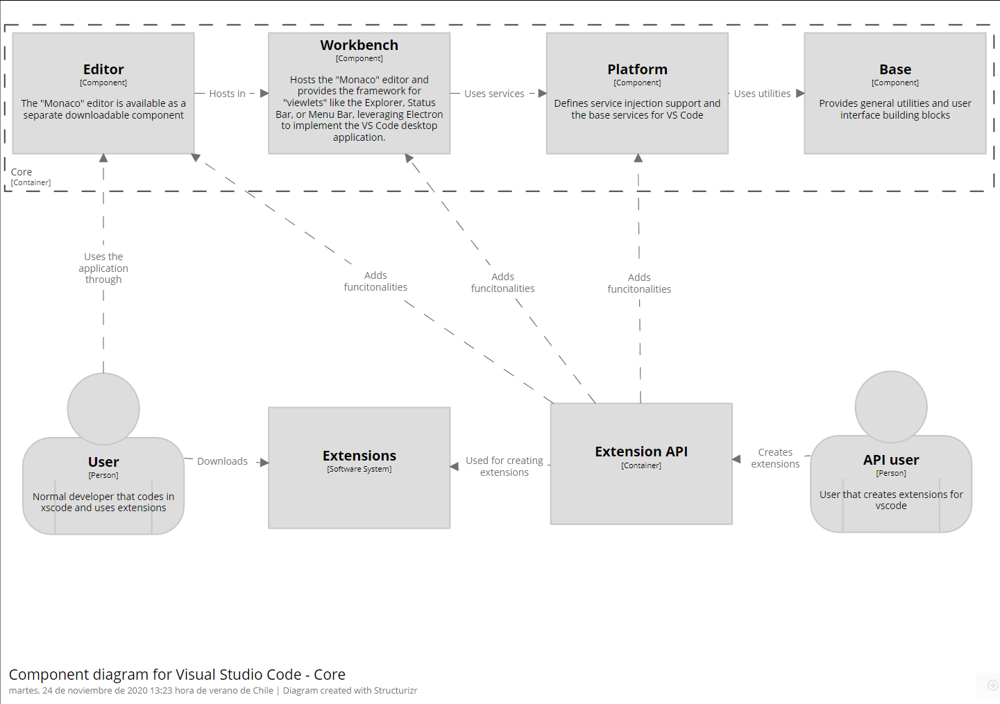
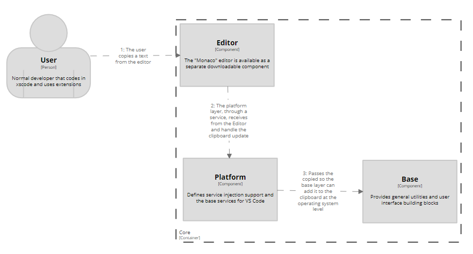
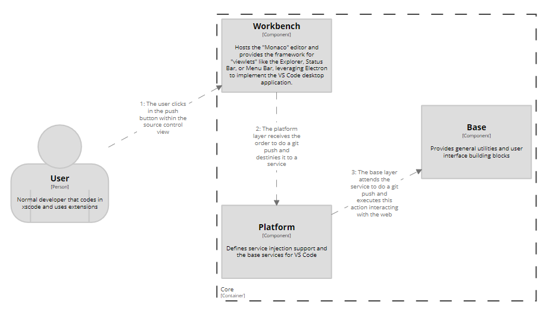
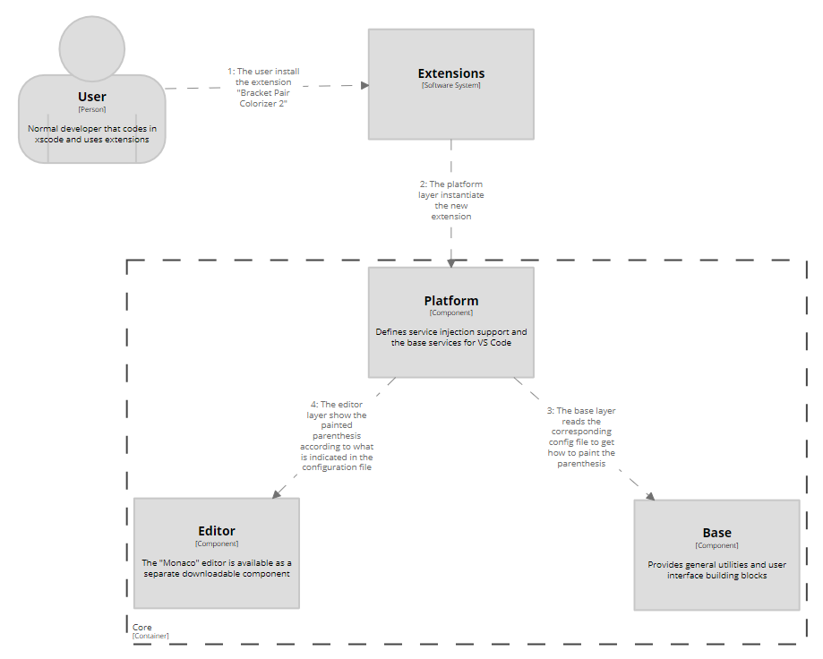

# VSCode - DeepDive

## Component diagram
We are going to describe the Core container, in which lies all the functionality of vscode and is the entry point for extensions.

### Components
The core is well divided in layers. Each one has its owns attributes and comunicates with the other layers.

1. Base layer: provides the overall structure for the other components in order to make them able to handle errors, process the events and declare the URI and UUID. Also, handles the node operations of the backend such as encryption, character encoding/decoding, directory and file manipulation and network handling. 
Also, this layer contains two other sub components: the `parts` environment and the `worker` environment. The parts environment has more sub parts, the first one, called `ipc`, handles the inter process comunication between processes in Visual Studio Code. Also we have the quickopen part, that handles the functionality of the quick open file menu. Lastly we have the `tree` part, which is the base implementation of the DOM of Visual Studio Code.
The `worker` environment is where scripts that runs in the background without affecting other services.

2. Platform layer: the main definition of this component is "service inyection and base services for Visual Studio Code". Regarding the service structure of Visual Studio Code, this layer provides services that can be reached by other parts of the application (also called clients). This component builds upon the base layer and creates registers and instances for everything in Visual Studio Code: commands, keybindings, the clipboard, the searchbar and markers. This is the entry point for the extensions, they can handle this layer and the following ones (workbench and editor)

3. Editor layer: handles the functionalities and displays the Monaco editor, in which Visual Studio Code is based. Handles syntax highlighting, copy/paste and text selection, among others. Also, handles some services like TextMate for grammar files. The last part of this layer is contributions. These are separate components that extends the functionalities and styling of the editor. This is the entry point for users due to the displaying feature of this layer

4. Worbench layer: hosts the Monaco editor and provides the framework for components like the explorer, status bar and menu bar. Also, it uses the Electron framework, especially the `electron-browser` environment. This environment handles functionalities of the editor such as crash reports, settings of the workbench, handling of keybindings, handling of extensions and all sorts of editor actions like zoom in/out, window switch and new tabs. All these functionalisies are managed by the `shell` which is like the container of all these functionalities that are separated in containers.

## Relevant workflows

1. Copy-to-clipboard dynamic workflow: when a normal user copies a text from the editor (as a piece of code), the platform layer creates an instance and registers a service to handle this copy of text to the clipboard. Then, because the platform layer builds upon the base layer, the base layer adds the copied text to the clipboard at the operating system level.

2. Git push dynamic workflow: when a normal user is working with git in vscode and wants to push his commits to a remote repository, he clicks in the push button within the source control view (a viewlet from the workbench layer). After that, the platform layer receives the order to do a git push and create an instance and registers a service to handle the action. Then, the base layer attends the service coming from the platform layer and executes the git push interacting with the web.

3. Dynamic workflow for installation of new vscode extension: a normal user wants to understand his code more quickly, so he installs the "Bracket Pair Colorizer 2" extension. Then, the platform layer register and also instantiate the new extension. After that, because the base and the platform layer are strongly connected, the base layer notes this and reads the corresponding config file to get how the extension works (how to paint the parentheses). Finally, the editor layer display the painted parentheses according to what is indicated in the configuration file.

