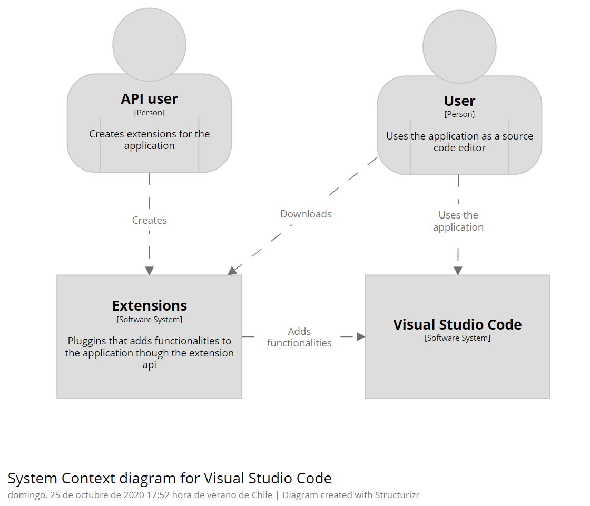
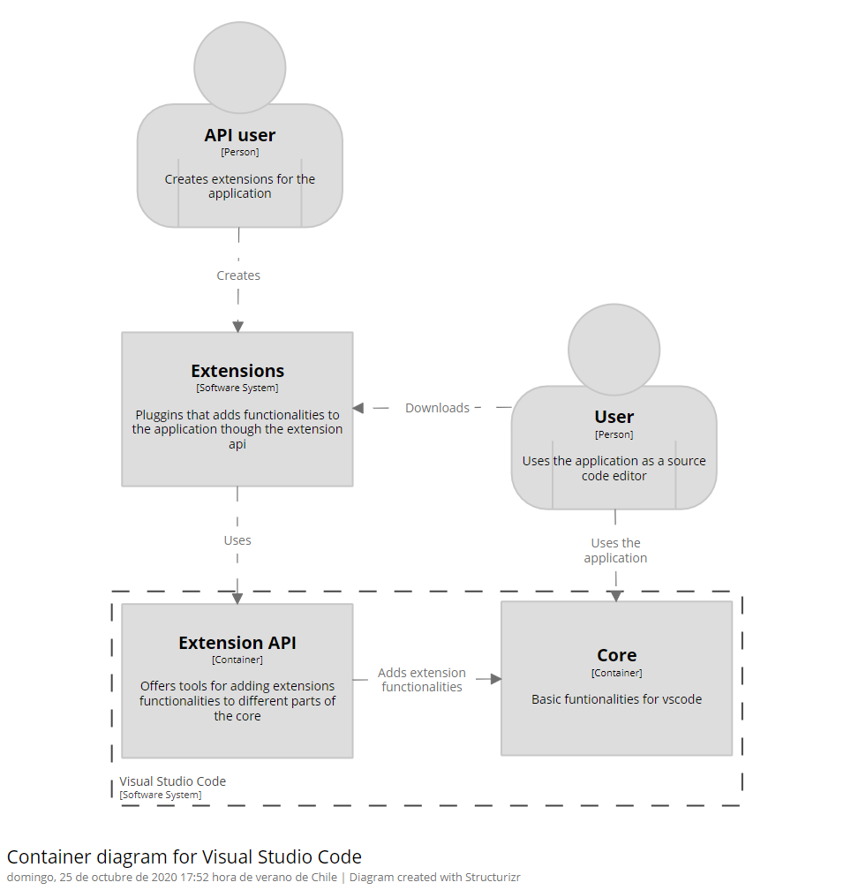

# VSCode - Overview

## 1. Description

### 1.1 Purpose of the system

The application is intended to be used for software development and general source code edition. Is a desktop application that works on Windows, Linux and macOS. The main characteristic of the application is its flexibility and extension availability, which makes the application very customizable, at the taste of the user.

### 1.2 System users

The application is mainly used by software developers that need a lightweight code editor. It is the most used code editor due to its flexibility and extension availability. Also, the Extension API, that provides functionalities for making other extensions.

We can recognize 2 kinds of users for the application.

- Normal users: Also known as developers, are those who use the application for coding purposes. They know how to use the application and use the extension system for personalization.
- Extension developers: Those who use the Extension API and develop extensions for the application. They may use the application for coding purposes but are diferenciated due its capabilities on extension development.

## 2 Visualization

The following diagrams describes 2 levels of the architecture of the system.

## 3. Quality Attrbiutes

//ToDo: Describe the 3 principal QAs for the project,based on your understanding of the system. Provide 1 relevant QAscenario for each.

### 3.1 QA description

The 3 principal QAs for VSCode, based on our understanding of the system, are as follows:

    1. Performance: this text editor stands out for being lightweight, and seeks that the user can code quickly. The extensions of VSCode add functionalities, however, these run in different processes, so the decrease little or nothing the performance of the software.

    2. Usability: this attribute, being one of the most important, also stands out in VSCode. First of all, this text editor has a huge list of keyboard shortcuts, which accelerate user interaction. Secondly, VSCode is available for Windows, macOS and Linux, i.e., the most used operating systems in the world. Also, it is easy to understand how to use it, where everything is, etc.

    3. Flexibility: this text editor is built with extensibility in mind, which makes it very flexible, since extensions provide a lot and in a wide range of functionalities, ranging from improving the UI and UX to support a new programming language or debugging a specific runtime.

### 3.2 QA scenarios

#### 3.2.1 Performance

1. Scenario description: 

2. Source: 

3. Stimulus/Event: 

4. Artifact: 

5. Environment: 

6. Response: 

7. Response measure:

#### 3.2.2 Usability

1. Scenario description: 

2. Source: 

3. Stimulus/Event: 

4. Artifact: 

5. Environment: 

6. Response: 

7. Response measure:

#### 3.2.3 Flexibility

1. Scenario description: A Ruby on Rails developer that uses VSCode was asked by his supervisor to develop a simple JavaScript application using NodeJS and other tools based on JavaScript. The developer rapidly downloads several extensions at the same time and the extension system integrates them into the application without VSCode application downtime.

2. Source: Developer downloading extensions.

3. Stimulus/Event: Several extensions being download.

4. Artifact: Extension system.

5. Environment: Normal operation.

6. Response: Response that extensions were downloaded, continue to operate.

7. Response measure: No downtime.
